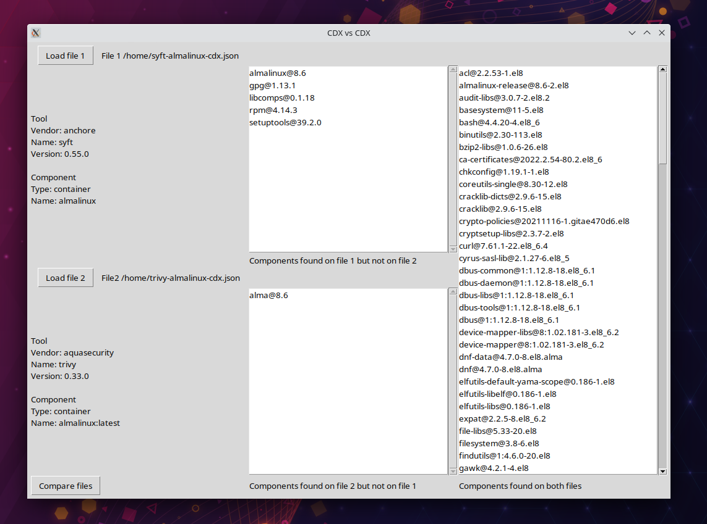

# CDX vs CDX

Compare two CycloneDX files in JSON format. See which components each one have that 
the other does not have and which components both have in common.

# How to run

## Option 1
### Currently only for Linux

Download the executable file `cdx-vs-cdx` on the releases page and run it.

## Prerequisites for options 2 and 3

1. [Python](https://www.python.org/) 3.10
2. [Poetry](https://python-poetry.org/) 1.1

## Option 2

1. Clone this repository.
2. Install the dependencies with `poetry install`.
3. Run the program with `poetry run python main.py`

## Option 3

1. Clone this repository.
2. Install the dependencies with `poetry install`.
3. Compile the program with `pyinstaller main.py`.
4. Run the executable `main` inside `cdx-vs-cdx/dist/main`.
